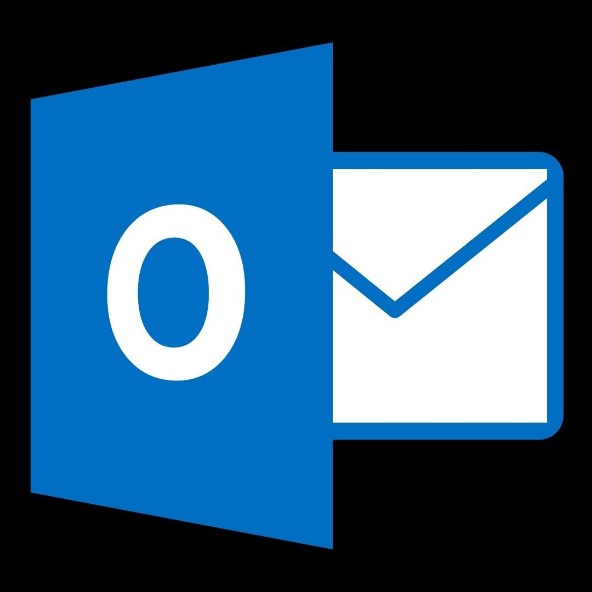

<html>
<body>
<h1 style="color:blue;font-size:50px;font-style:oblique">

	 <b><i> Hi there</b></i> </h1>
</html>
</body>

<!--END_SECTION:waka-->

 
<html>
<body>
<h2 style="color:blue;font-size 50px">
<b>📫 Contact me •ᴗ• </b></h2>
</html>
</body>

 

<!--
**atasbircan/atasbircan** is a ✨ _special_ ✨ repository because its `README.md` (this file) appears on your GitHub profile.

Here are some ideas to get you started:

- 🔭 I’m currently working on ...
- 🌱 I’m currently learning ...
- 👯 I’m looking to collaborate on ...
- 🤔 I’m looking for help with ...
- 💬 Ask me about ...
- 📫 How to reach me: ...
- 😄 Pronouns: ...
- ⚡ Fun fact: ...
-->
